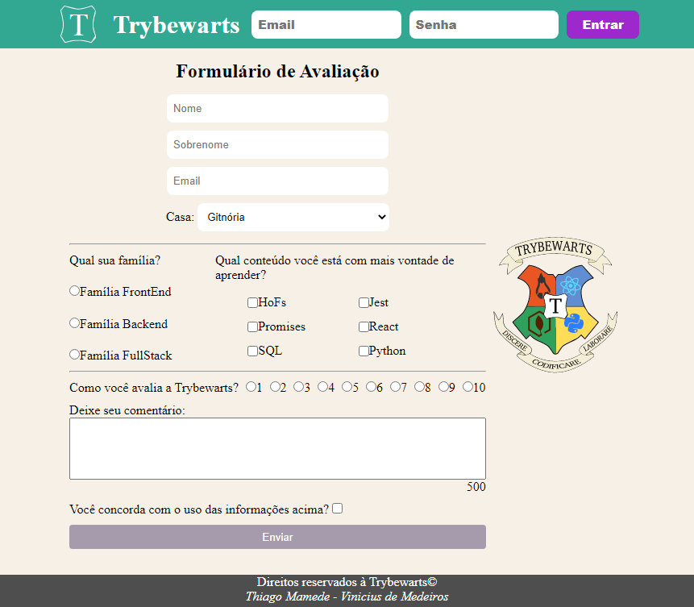
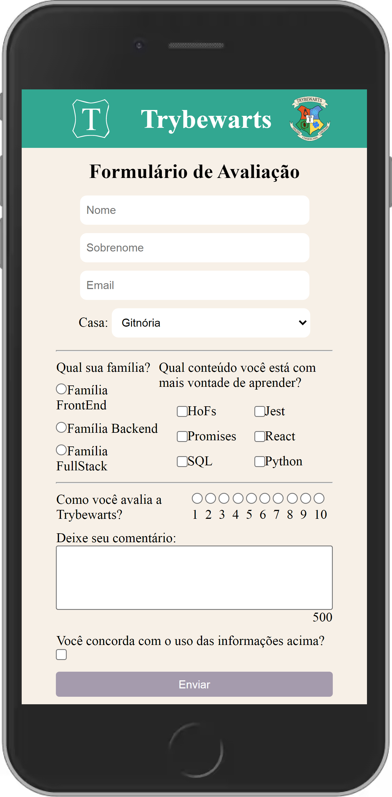

<h1 align="center">Boas vindas ao repositório do Projeto TrybeWarts</h1>

<h1>Sobre: </h1>

  
Este projeto foi desenvolvido em parceria com <a href="https://github.com/tmamedeTrybe">Thiago Mamede</a> durante o Módulo de Fundamentos do Desenvolvimento Web, da <a href="https://www.betrybe.com/"><i>Trybe</i></a>.

  
O desafio deste projeto foi desenvolver uma página de formulário da Escola de Magia de Trybewarts, em que as pessoas estudantes poderão enviar seus feedbacks sobre ela. O tema desse projeto é baseado na obra 'Harry Potter', de J. K. Rowling.

  <h2>Habilidades<h2>
  <li>HTML5</li>
  <li>CSS3</li>
  <li>Versionamento de códigos com Git</li>
  <li>Comunicão, organização, trabalho em equipe</li> 

<h3>Pré-visualização</h3>

  <a href="https://trybewarts-web.vercel.app/" target="_blank">Confira aqui a aplicação</a>

  
  

